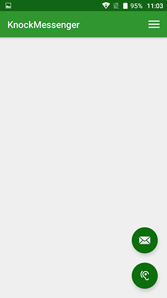
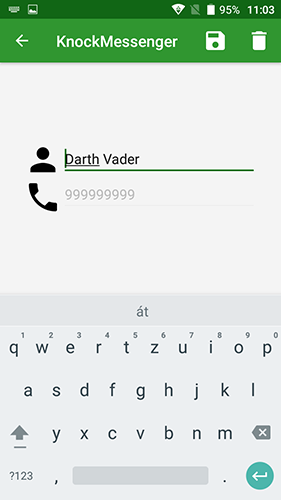
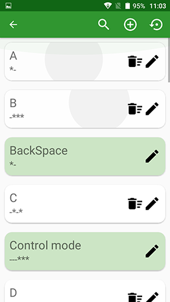
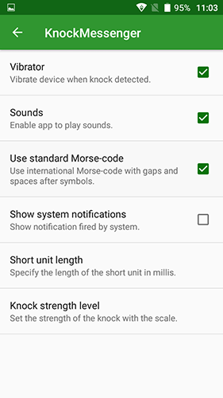
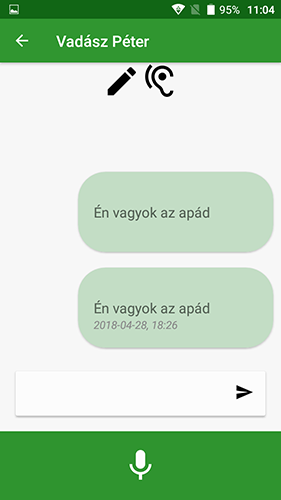
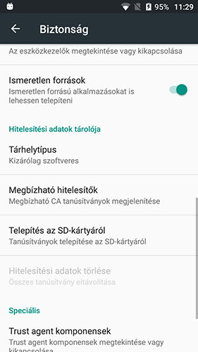

# KnockMessenger

## [Letöltés](http://vadaszfoto.hu/KnockMessenger/)

* [Bevezetés](README.md#bevezetés)
* [Funkciók](README.md#funkciók)
* [Platform](README.md#platform)
* [Telepítés](README.md#telepítés)
* [Build](README.md#build)
 * [Travis CI](#travis-ci)
* [Tesztek](README.md#tesztek)
* [Fejlesztői eszközök](README.md#fejlesztői-eszközök)
  * [Lint](README.md#lint)
* [Deploy](README.md#deploy)
* [Megjegyzés](README.md#megjegyzés)

## [Bevezetés](#intro)

Az alkalmazás Morzekód formájú kommunikációt valósít meg mobiltelefonok között. Küldő oldalon az üzenet megadása a készülék egyenletes sima felületre (pl. asztal) történő helyezése után a telefon melletti ritmikus - pl a Morzekódnak megfelelő - kopogás segítségével lehetséges.
A kopogás detektálás az eszköz mikrofonján keresztül a mért zajszintek segítségével történik. A telefontól megkapott nyers adatok feldolgozásával értelmezhető jelsorozatot állítunk elő, ami továbbküldhető a választott címzettnek. Üzenet írás közben speciális kopogás minta hatására az alkalmazás szerkesztő üzemmódba kapcsol, ami lehetővé teszi az aktuális pozíción lévő karakter törlését és a szövegben való ugrásokat.

## [Funkciók](#features)

Az alkalmazás rövid üdvözlőképernyő után indul. 

**Figyelem: Android 6 (Marshmallow) rendszeren az üzenetek fogadása csak akkor lehetséges, ha az alkalmazás nem lett kilőve!**

### Főablak

A főablakon jelenik meg az összes olyan üzenet, ami nem közvetlen ismerősöktől, vagy korábbi ismerősöktől érkezett. Az választott üzenetre kattintva megjelenik küldés időpontja, ismét rákattintva eltűnik. Az ablakon két további gomb foglal helyet alul, a felső segítségével üzenet küldést kezdeményezhetünk, az alsó a kopogás erősségének felmérését teszi lehetővé. A főablakban az állapotsorban lévő ikon segítségével, illetve jobbra pöccintéssel hozható elő a főmenü.
Az alkalmazás két féle formájú ábécé feldolgozására képes, hagyományos Morse-Code a nemzetközi Morse ábécével, ez esetben a betűk és szavak között szünetet kell tartani, illetve Huffman-kód formájú ábécé, prefix kódokkal.

### Profil

Első használat előtt megadandó egy választott név és telefonszám. A név tetszőleges, de nem lehet üres, a telefonszám globálisan egyedi kell, hogy legyen, csak számjegyeket tartalmazhat, legfeljebb az első karakter lehet egy + jel és legalább 9 karakter hosszúnak kell lennie. Ha ezek a feltételek nem teljesülnek az alkalmazás hibaüzenet formájában jelzi és nem kerül sor az adatok mentésére. A mentéshez internetkapcsolatra van szükség, ha nem sikerül csatlakozni, akkor a mentés sikertelen lesz. A mentés a floppy ikon segítségével lehetséges.
Az adatok megváltoztatása később ugyanitt lehetséges, a név változhat a telefonszám nem, a fenti feltételek továbbra is érvényesek. 
A kuka ikon segítségével lehetőség van a felhasználó törlésére is, ehhez internatkapcsolatra van szükség.
**Figyelem: törlés után az összes üzenet elveszik és a megadott telefonszám nem lesz újrahasználható.** 

### Code abc

A felületen kártyákon megjelennek a tárolt ábécé karakterei s vezérlő szimbólumai, lehetőség van a kódok törlésére szerkesztésére, új kód felvételére. A vezérlő szimbólumok szerkeszthetőek, de nem törölhetőek. A menüsörban lévő nyíl ikon segítségével bármikor visszaállhatunk az alapértelmezett ábécére. Balra pöccintés esetén az adott kártya törlésre kerül, ezt meg kell erősíteni, jobbra pöccintés esetén szerkeszthető lesz. Ezeket a funkciókat a kártyákon elhelyezett gombok segítségével is kezdeményezhetjük.

### Friends

Az ismerősök lapon a felvett ismerősök jelennek meg, a menüsorban lévő szinkronizációs gomb (nyílak) segítségével bármikor kérhetjük az adatok frissítését, de ez a funkció indulásakor magától is megtörténik. A kártyákon lévő gombok segítségével törölhetjük az ismerősöket illetve üzenetküldést kezdeményezhetünk. A menüsorban található jobboldali ikon segítségével pedig az alkalmazás felhasználói között böngészhetünk és ismerősöket vehetünk fel. Üzenetküldés csak ismerősnek lehetséges, azonban nincs szükség az ismerettség visszaigazolására fogadó oldalon. Ha nincs internetkapcsolat, az adatok nem frissülnek, ezt jelzi az alkalmazás.

### Delete messages

Lehetőség van az összes üzenet (küldött/fogadott) törlésére, jelenleg kíséreleti funkció.

### Settings

A beállítások fülön az alklamazás paramétereit kalibrálhatjuk. Lehetőség van a rezgőmotor használatára, a detektálás során segítő hangjelzések aktiválására, rendszerüzenetek megjelenítésére (kritikus pontok esetén). Továbbá kiválaszthatóóó, hogy Morse vagy Huffman formában szeretnénk üzenetet küldeni. Megadható, hogy hány milisec legyen a "ti" szótag ideje, minden további ennek lesz a többszöröse. Illetve, kiválasztható, hogy milyen erősségű zajt ismerjünk fel kopogásnak egy 10-es skálán.

### Messages

Az üzenetküldő ablakon legfelül megjelenik, hogy milyen üzemmódban vagyunk, beviteli vagy szekesztő. Illetve, hogy az alkalmazás adott időpillanatban milyen szótagot tud detektálni kopogás hatására. A detektálást a felület alján lévő mikrofon ikon segítségével indíthatjuk el. Az első kopogás hatására elindul a detektálás. A detektál szótagok megjelennek e felületen *(ti), -(tá).

* Morse-mód: három ikon jelenik me váltakozva, egy pötty, ez esetbe ti szótagot ismer fel, négyzet esetén tá, vonalak esetén betűköz, ha szóköz esetén nincs szükség kopogásra a harmadik ikon esetén sem, megadott idő után leáll a detektor egy szóközzel. Dekódolásra csak betűköz és szóköz esetén van lehetőség, ekkor az alkalmazás megjeleníti a dekódolt kódszót vagy hibaüzenetet, ha semmit nem ismert fel.

* Huffman-mód: két ikon jelenik meg, ti és tá, illetve szótag detektálása után megadott időn belül új szótagot kell kopogni, különben hibával leáll a detektor. A prefix kód miatt a felismert betűk detektálás közben azonnal megjelennek, nincs szükség szünetekre.
**Figyelem: tényleges szóköz nem kerül a szövegbe!**

## [Platform](#platform)

Az alkalmazás által támogatott Android verziók:
* Android 6.0 - Marshmallow (API level 23)
* Android 7.0, 7.1 - Nougat (API level 24, 25)
* Android 8.0 - Oreo (API level 26): **Jelenleg teszt alatt**

## [Telepítés](#install)

Az alkalmazás a build-elt apk-t a megadott platformra letöltve telepíthető. A telepítéshez emulátor is használható, de mindenképpen engedélyezni kell az *Ismeretlen forrásokból* való telepítést a Beállítások menü Biztonság füle alatt, lásd az alábbi képet. A szükséges engedélyek megadása után az apk fájl kiválasztásával a Telepítés lehetőségre kattintva automatikusan elindul a telepítés és az alkalmazás az eszköz kapacitásától függően néhány másodperc alatt kész a használatra. 

## [Build](#build)

Az alkalmazás buildeléséhez legalább **API level 23 Android sdk** és **Java SE 8 JDK** szükséges. A szükséges konfigurációk az **[app/build.gradle](app/build.gradle)** fájlban találhatóak. A build előtt **Windows** operációs rendszer esetén szükséges egy saját környezeti változó létrehozása **JAVA_HOME** néven, értéke pedig a Java 8 JDK bináris könyvtárának elérési útvonala.

A szükséges beállítások elvégzése után Windows operációs rendszer esetén az [auto_deploy_win.ps1](auto_deploy_win.ps1), Linux és Mac operációs rendszer esetén az [auto_build_linux.sh](auto_build_linux.sh) script használható. A build-elt alkalmazás a **KnockMessenger\app\build\outputs\apk\debug\app-debug.apk** útvonalon érhető el. Az [auto_deploy_linux.sh](auto_deploy_linux.sh) egy egyszerűsített script a Travis CI számára.

Az alkalmazás build-eléséhez az [Android Studio 3.1](https://developer.android.com/studio/)-t ajánljuk!

### [Travis CI](#travis)

Jelen repository minden változása (push, pull request) esetén elindul egy automatizált build a Travis CI rendszer segítségével. Az eredmények megtekinthetőek itt: [https://travis-ci.org/KnockMessenger/KnockMessenger](https://travis-ci.org/KnockMessenger/KnockMessenger), illetve a jelen fájl tetején lévő build ikonra kattintva. A Travis CI instrumentális teszteket is futtat amihez emulátort használ, így a build ideje hozzávetőlegesen 10-12 perc. A részletes beállítások a [.travis.yml](.travis.yml) konfigurációs fájlban találhatóak.

## [Tesztek](#test)

A Unit tesztekhez JUnit keretrendszert a tesztekhez szükséges mock-ok elkészítséhez [Mockitot](https://developer.android.com/training/testing/unit-testing/local-unit-tests) használunk, a tesztek eredménye html formában is megtekinthető az alábbi mappában: **KnockMessenger/reports**. A build-hez használ script-ek automatikusan futtatják a teszteket és exportálják az eredményt. A teszrendszer konfigurációja megtalálható az egyes moduloknak megfelelő **build.gradle** fájl **testOptions** pontja alatt, az eredmény a build scriptek futtatásakor a standard kimeneten is megjelenik.
**Az alkalmazás tesztelése még folyamatban van!**

## [Fejlesztői eszközök](#devTools)

### [Lint](#lint)

A forrásfájlok elemzéséhez és az esetleges hibás kiszűrésére [Lint](http://tools.android.com/tips/lint)-et használunk, a konfiguráció az **build.gradle** fájl **lintOptions** pontja alatt található. Az eredmények a build scriptek futtatása után a **\<module\>\build\reports\lint-results.html** helyen találhatóak.

## [Deploy](#deploy)

A build-elt alkalmazás közzététele automatikusan megtörténi a build scriptek segítségével, a telepíthető alkalmazás az alábbi helyen érhető el [vadaszfoto.hu/KnockMessenger/](http://vadaszfoto.hu/KnockMessenger/).

## [Megjegyzés](#notification)

Az alkalmazás az **ELTE - IK PTI** *(ANA)* szakon írt diplomamunkám, kereskedelmi forgalomba nem hozható!
